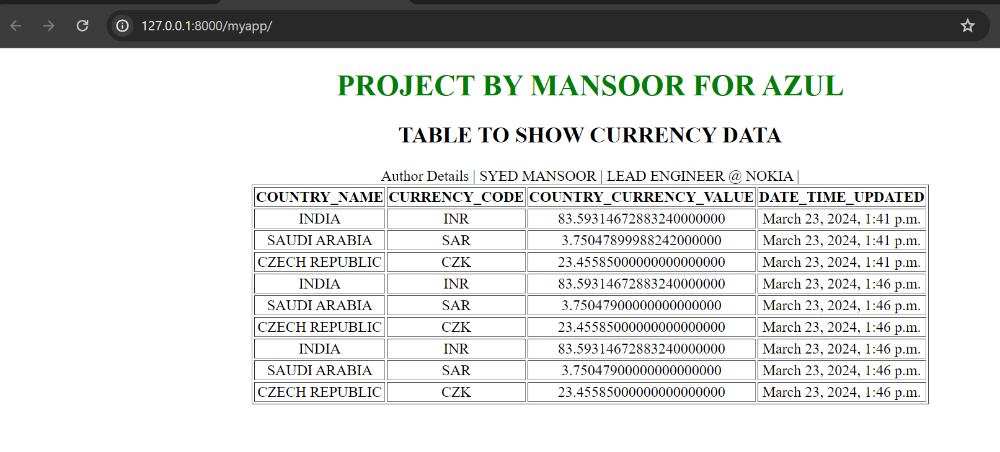
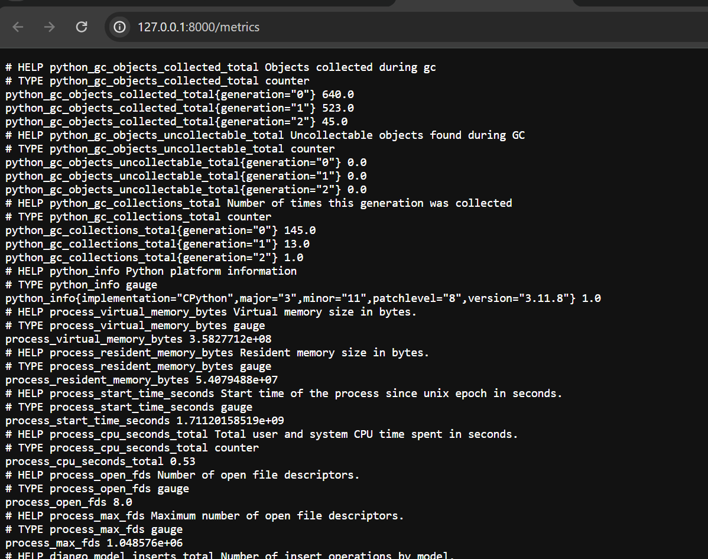
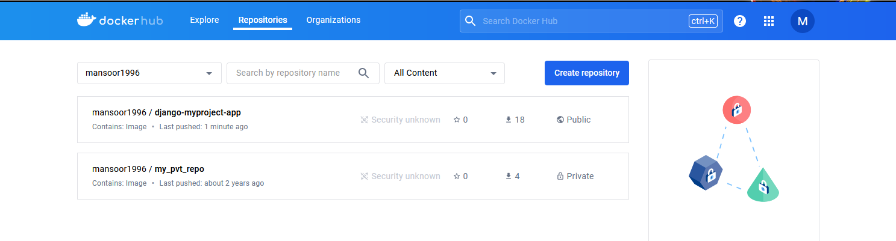
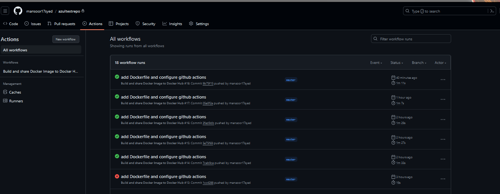
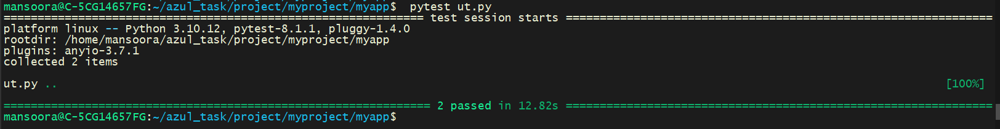

# PROJECT BY MANSOOR FOR AZUL  
This is a simple project which shows US currency rates against 3 countries namely INDIA,SAUDI ARABIA and CZECH REPUBLIC.
The data shows country name, country code , the value against US dollars and the last updated date and time. The data is downloaded data from https://docs.cloud.coinbase.com/sign-in-with-coinbase/docs/api-exchange-rates#get-exchange-rates.
And displays the rendered data in a HTML page. Every refesh of the page the data is fetched and updated to show the currecny rates. This project is developed using python,djago,sql-lite,docker and gitlab CI.  

# Table of contents  
1. [ABOUT THE AUTHOR](#introduction)  
2. [HOW DID I DEVELOP THE PROJECT](#paragraph1)  
3. [WHAT DID I INSTALL](#paragraph2)  
3. [TESTING THE CODE](#paragraph2)  
3. [HOW DID I USE DOCKER and GIT.](#paragraph2)  
3. [INTEGRATION OF PROMETHEUS](#paragraph2)  
3. [SNAPS OF APPLICATION](#paragraph2)  

## ABOUT THE AUTHOR
NAME:- SYED MANSOOR     
LINKEDIN_PROFILE:- http://linkedin.com/in/syed-mansoor17     
PROJECT_GIT_LINK:- https://github.com/mansoor17syed/azultestrepo                                                                
PROJECT_DOCKER_HUB_LINK:- https://hub.docker.com/repository/docker/mansoor1996/django-myproject-app

## WHAT DID I DO/APPROACH
1.Installed python and django.               
2.Made all the required code changes for frontend and backend.          
3.Downloaded the sample data from given URL         
4.Displayed all the data on a sample HTML page.            
5.Stored all the data in built-in sql-lite db

## TESTING THE CODE
1.I have added simple UT using pytest for the download data.     
2.The UT was executed to validate and check the function.

## HOW DID I USE DOCKER and GIT.
1.Create a docker container to encapsulate the code and its dependencies.           
2.Created a dockerfile to create a image and encapsulate all of the code.           
3.Pushed maintined the code on github.                                                                              
4.Added gitlab CI to automate the deployment and pushing of images to docker-hub       
5.Created a docker compose to fetch and deploy the django application via docker-container

## INTEGRATION OF PROMETHEUS
1.I have also installed prometheus locally and integrated with the application.             
2.I installed the prometheus package for django and made sure metrics are generated.                                                                                             
3.Prometheus integration with the application is captured and the file is attached. FILE_NAME - PROMETHEUS_MONITOR_STATUS_DJANGO.pdf      
4.The target is also added in prometheus for django.Below is the conf

~~~bash  
         # my global config
         global:
         scrape_interval: 15s # Set the scrape interval to every 15 seconds. Default is every 1 minute.
         evaluation_interval: 15s # Evaluate rules every 15 seconds. The default is every 1 minute.
         # scrape_timeout is set to the global default (10s).

         # Alertmanager configuration
         alerting:
         alertmanagers:
             - static_configs:
                 - targets:
                 # - alertmanager:9093

         # Load rules once and periodically evaluate them according to the global 'evaluation_interval'.
         rule_files:
         # - "first_rules.yml"
         # - "second_rules.yml"

         # A scrape configuration containing exactly one endpoint to scrape:
         # Here it's Prometheus itself.
         scrape_configs:
         # The job name is added as a label `job=<job_name>` to any timeseries scraped from this config.
         - job_name: "prometheus"

             # metrics_path defaults to '/metrics'
             # scheme defaults to 'http'.

             static_configs:
             - targets: ["localhost:9090"]
         - job_name: docker
             # metrics_path defaults to '/metrics'
             # scheme defaults to 'http'.

             static_configs:
             - targets: ["127.0.0.1:8000"]
~~~

## TECH STACK 

**DEV:** Python,django  
**TEST:** Pytest  
**CONTAINER:** Docker,docker-compose,docker-hum,                     
**VERSION_CONTROL:** github              
**CI/CD:** github_actions

## FEATURES

- Downloads data from the given API 
- Shows on HTML page  
- Once the user refreshes/reloads the page the data reloads.
- Integration with Prometheus

## LESSONS LEARNED  

I Learned how the tech stack I used works and how do we integrate it.           
1. I learnt how Django is a high-level Python web framework that encourages rapid development and clean, pragmatic design.  
2. Docker is a containerization platform that allows you to package your applications and their dependencies into lightweight containers which helps in Simplified deployments,Improve scalability and so on.
3. GitLab CI: GitLab CI is a continuous integration and continuous deployment (CI/CD) tool provided by GitLab, enabling you to automate the testing and deployment of your applications.
4. Overall, mastering Django, Python, Docker, and GitLab CI will equip you with the skills and tools necessary to develop, deploy, and maintain robust web applications efficiently.

## RUN LOCALLY

Clone the project  

~~~bash  
  git clone https://github.com/mansoor17syed/azultestrepo.git
~~~

Run the Application using the docker compose file  

~~~bash  
sudo docker-compose up
~~~

Once the compose is up open browser and enter the below address.Acess development server at.

~~~bash  
http://127.0.0.1:8000/
~~~
## SNAPS OF APPLICATION

## FEEDBACK  

If you have any feedback, please reach out to us at mansoor17syed@gmail.com

## LICENSE

