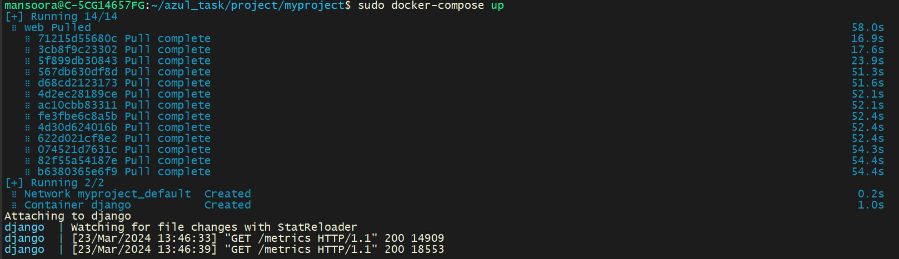

AUTHOR:-
NAME:- SYED MANSOOR
LINKEDIN_PROFILE:- http://linkedin.com/in/syed-mansoor17
PROJECT_GIT_LINK:- https://github.com/mansoor17syed/azultestrepo
PROJECT_DOCKER_HUB_LINK:- https://hub.docker.com/repository/docker/mansoor1996/django-myproject-app

NAME:- PROJECT BY MANSOOR FOR AZUL

DESCRIPTION:-
This is a simple project which download data from https://docs.cloud.coinbase.com/sign-in-with-coinbase/docs/api-exchange-rates#get-exchange-rates.
And displays the rendered data in a HTML page.This project is developed using python,djago,sql-lite,docker and gitlab CI.

INSTALLATION:-
The end user shall just clone the project and just bring up the project using the docker-compose file.
Just execute the compose cmd "sudo docker-compose up"

Example:-
mansoora@C-5CG14657FG:~/azul_task/project/myproject$ sudo docker-compose up

HOW DID I DEVELOP THE PROJECT:-

1. WHAT DID I INSTALL
        1.Installed python and django.
        2.Made all the required code changes for frontend and backend.
        3.Downloaded the sample data from given URL
        4.Displayed all the data on a sample HTML page.
        5.Stored all the data in built-in sql-lite db

2. TESTING THE CODE
        1.I have added simple UT using pytest for the download data.
        2.The UT was executed to validate and check the function.

3. HOW DID I USE DOCKER and GIT.
        1.Create a docker container to encapsulate the code and its dependencies.
        2.Created a dockerfile to create a image and encapsulate all of the code.
        3.Pushed maintined the code on github.
        4.Added gitlab CI to automate the deployment and pushing of images to docker-hub
        5.Created a docker compose to fetch and deploy the django application via docker-container

4. INTEGRATION OF PROMETHEUS.
        1.I have also installed prometheus locally and integrated with the application.
        2.I installed the prometheus package for django and made sure metrics are generated.
        3.Prometheus integration with the application is captured and the file is attached. FILE_NAME - PROMETHEUS_MONITOR_STATUS_DJANGO.pdf
        3.The target is also added in prometheus for django.Below is the conf 

                # my global config
                global:
                scrape_interval: 15s # Set the scrape interval to every 15 seconds. Default is every 1 minute.
                evaluation_interval: 15s # Evaluate rules every 15 seconds. The default is every 1 minute.
                # scrape_timeout is set to the global default (10s).

                # Alertmanager configuration
                alerting:
                alertmanagers:
                    - static_configs:
                        - targets:
                        # - alertmanager:9093

                # Load rules once and periodically evaluate them according to the global 'evaluation_interval'.
                rule_files:
                # - "first_rules.yml"
                # - "second_rules.yml"

                # A scrape configuration containing exactly one endpoint to scrape:
                # Here it's Prometheus itself.
                scrape_configs:
                # The job name is added as a label `job=<job_name>` to any timeseries scraped from this config.
                - job_name: "prometheus"

                    # metrics_path defaults to '/metrics'
                    # scheme defaults to 'http'.

                    static_configs:
                    - targets: ["localhost:9090"]
                - job_name: docker
                    # metrics_path defaults to '/metrics'
                    # scheme defaults to 'http'.

                    static_configs:
                    - targets: ["127.0.0.1:8000"]

5. BELOW ARE THE SNAPS OF APPLICATION

